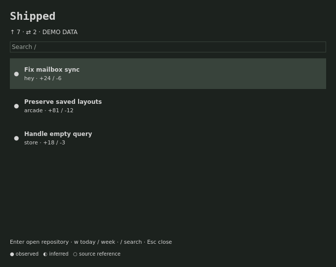

# Shipped

<p>
<a href="https://github.com/tcballard/omarchy-plugin-shipped/actions/workflows/test.yml"></a>
<a href="LICENSE"></a>
<a href="https://github.com/tcballard/omarchy-badges"></a>
</p>

**See what you shipped.**

A native Omarchy bar plugin for developers who want a view of their day or week across local Git repositories. See commits attributed to your configured email addresses, their subjects and line changes. Opt into merged-PR and review-request counts through your existing GitHub CLI login.

On Omarchy Quattro, with the dependencies below installed:

```sh
omarchy plugin add https://github.com/tcballard/omarchy-plugin-shipped.git
```

Then [enable the plugin and add its bar widget](#use).

**Development preview · 0.1.0-preview.1.** Portable tests and QML fixture checks pass; live Omarchy acceptance is still outstanding. [Verification](VERIFICATION.md) · [Current limits](docs/STATUS.md) · [View the fixture preview](preview.png).

<details>
<summary>Files, processes and network access</summary>

Reads local Git history and configured author identities; writes ~/.local/state/shipped; executes local CLI collectors and explicit actions; no network by default; opt-in gh queries use GitHub and opening a PR uses the browser; no root.

</details>

Dependencies (review and install yourself):

```sh
pacman -S nodejs jq git bash
```

Optional: authenticated GitHub CLI (gh) for remote counts, xdg-open for PR links, and a supported terminal for opening repositories. Alacritty, Ghostty and Kitty are supported; TERMINAL must be an executable name/path without embedded arguments. No packages, hooks or shell configuration are installed by the plugin loader.



## Use

Add this standalone Git repository with `omarchy plugin add https://github.com/tcballard/omarchy-plugin-shipped.git`, review it, then enable `io.github.tcballard.shipped` and place its widget in the bar. Development preview source is available in this repository; no tagged release or marketplace approval is claimed.

The panel is native QML in Quattro. Click to open; j/k or arrows select; / searches; Escape closes. Enter open repository; w toggle today/week. Commands that change files, deployments, plugins or processes are staged in a terminal: Enter is the review/execute boundary.

Config is optional: `~/.config/shipped/config.json` (XDG overrides respected). Copy `config.example.json` only if you need to change defaults. State is `~/.local/state/shipped/`. Updates do not replace either directory.

`omarchy-shell io.github.tcballard.shipped refresh` requests a refresh; `status` returns a bounded status summary. The built-in trusted bar can resolve the service. A third-party replacement bar may not have service access; the widget reports unavailable.

## Behavior and limits

An empty authorEmails list uses each repo user.email. Commits are selected by exact author email. Agent committer identity does not remove your authorship. The optional coauthor toggle excludes commits with Co-Authored-By trailers. Commit and PR totals are separate, not reconciled. GitHub result lists are bounded to 100; merged PRs are filtered by their close timestamp against local midnight. gh must already be authenticated; the plugin does not read tokens.

Complements Meanwhile: review requests are a count, not another review inbox.

## Verify

`./tests/run` runs model tests and portable manifest validation. On Omarchy also run `omarchy plugin validate .` and test actual enable/disable, IPC, orientation, monitor and terminal behavior. The screenshot uses real Panel.qml with host stubs and fictional data; it is not a live desktop screenshot.

## Remove

Disable/remove through Omarchy. Collection stops with the hosted service. User configuration and state remain intentionally.

Apache-2.0. Contributions require DCO sign-off (`git commit -s`).

## Update and remove

Install with `omarchy plugin add https://github.com/tcballard/omarchy-plugin-shipped.git`. Then:

```sh
omarchy plugin enable io.github.tcballard.shipped
omarchy plugin update io.github.tcballard.shipped
omarchy plugin disable io.github.tcballard.shipped
omarchy plugin remove io.github.tcballard.shipped
```

## Compatibility

Targets the Quattro hosted service/bar-widget API. No live Omarchy version or supported version range is certified by this preparation. Node 22+ is required. See [verification](VERIFICATION.md) and [remaining scope](docs/STATUS.md).
